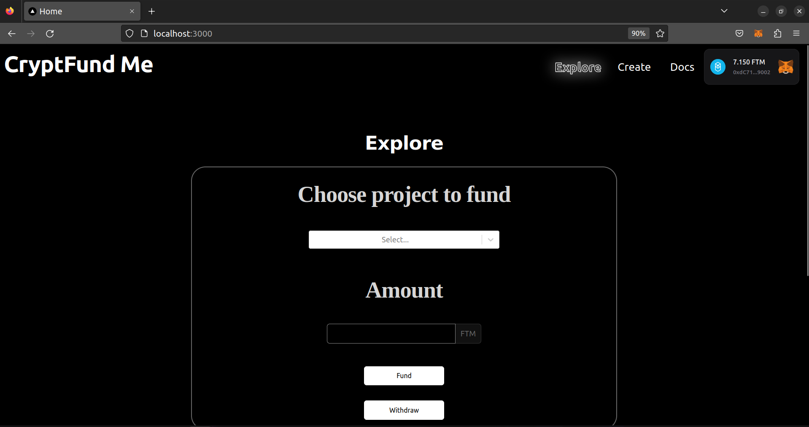
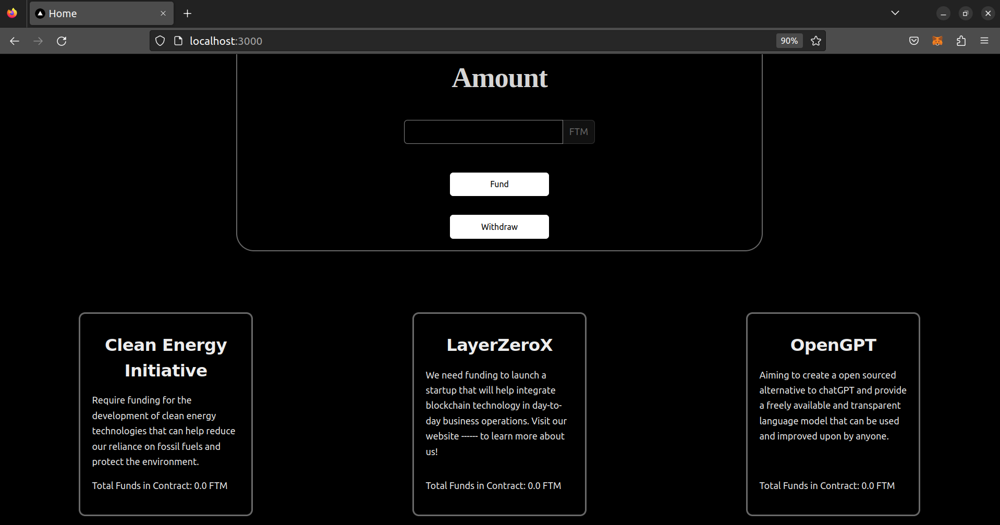
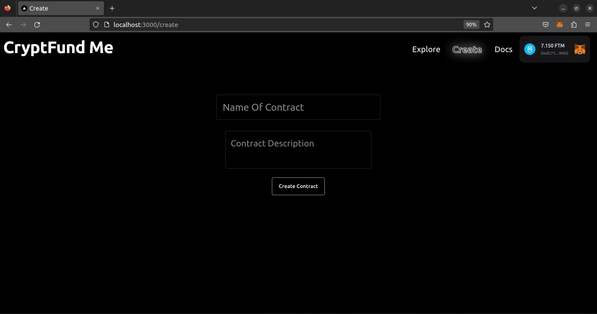
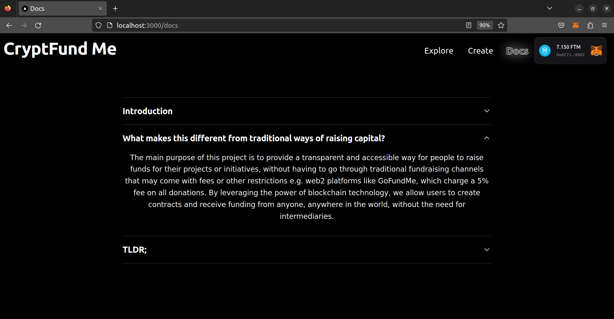

# CryptFund Me

CryptFund Me is a decentralized platform that allows anyone to create a contract with a name and description and enables others to fund it without any fees. The platform is built on blockchain technology, which means that it is highly secure and transparent, with all transactions recorded on a public ledger.

## Getting Started

First, run the development server:

```bash
npm run dev
# or
yarn dev
# or
pnpm dev
```

Open [http://localhost:3000](http://localhost:3000) with your browser to see the result.


## Features

- Decentralized platform:  By leveraging the decentralized nature of blockchain, we are able to provide a trustless system where anyone can create and fund contracts without relying on a central authority.
- No fees: Unlike traditional crowdfunding platforms, CryptFund Me does not charge any fees to either creators or funders.
- Flexible contracts: Users can create contracts for any purpose they choose, with no restrictions on the type of project or initiative they want to fund.
- Clean UI: CryptFund Me features a simple and intuitive user interface that is easy to navigate, making it accessible to users of all technical levels. The platform was built using Next.js

## Images





